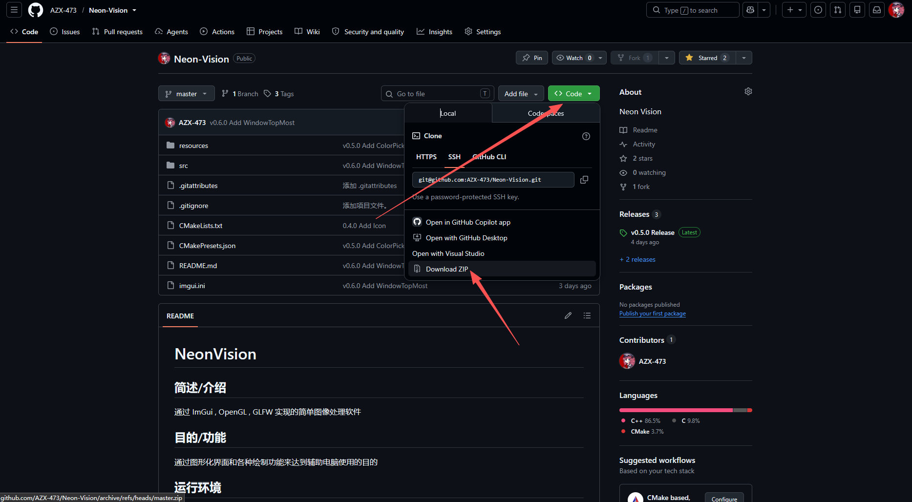

# 下载

#### 1.到[github仓库releases](https://github.com/AZX-473/Neon-Vision/releases/latest)下载最新的编译结果

#### 2.双击NeonVision-Setup.exe,将会自动安装

# 编译

#### 1.转到[项目github仓库](https://github.com/AZX-473/Neon-Vision)

#### 2.点击右上角绿色code,点击Download ZIP,或直接点击[本链接](https://github.com/AZX-473/Neon-Vision/archive/refs/heads/master.zip)下载

#### 

#### 3.读[项目README](https://github.com/AZX-473/Neon-Vision/blob/master/README.md),我觉得已经写的很详细了

#### 4.请一定要**设置vcpkg的环境变量**,不然你会在编译步骤被折磨死

### 编译完成的结果不是安装包而是程序的可执行文件和依赖，请手动将除程序外的资源连同文件夹复制进程序文件夹内

#使用

#### 主菜单按右Ctrl打开,不要再问了
#### 会自动更新，无脑下一步即可
